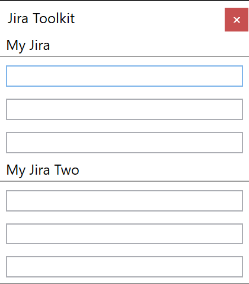

# JiraToolkit

## Usage

The jira toolkit application is used to provide an easy way to manage multiple jira environments. It is possible to fill in multiple different jira urls and prefixes for tickets. The textboxes for each environment allow the user to enter a number, press enter and jump directly to the ticket, without opening jira and manually searching for the tickets.




## Configuration

Use the configuration.json to configure the application, fill it with jira environments and ticket prefixes. An example configuration is included after installation in the application folder.

### Example Configuration

```json
{

  "StayOnTop": true,
  "Environments" :[
    {
      "Name": "My Jira",
      "Prefixes": [
        "PREFIX1",
        "PREFIX2",
        "PREFIX3"
      ],
      "RootUrl": "https://Url.To.My.Jira.com/"
    },
    {
      "Name": "My Jira Two",
      "Prefixes": [
        "PREFIX4",
        "PREFIX5",
        "PREFIX6"
      ],
      "RootUrl": "https://Url.To.My.JiraTwo.com/"
    }
  ],
    "Queries": [
    {
      "Name" : "Query One",
      "Url" : "{{param}}"
    }
  ]
}
```

### Using Queries

A query is an object which contains a parameterizable Url and its name. The name is used so the user can easily recognize the corresponding query url.
```{{param}}``` is used to mark a parameter inside the Url. Currently only one parameter is supported inside a query url.

#### Example

The ```{{param}}``` tag will be replaced with the value inside the Textbox of the query object.

```
"Url": "https://github.com/{{param}}"
```
Enter ```Tymoniden``` into the corresponding parameter Textbox and press enter. The default browser will open with the url ```https://github.com/Tymoniden```.

### Stay On Top

The stay on top property controls the Topmost property of the wpf window. To let the application force into the front, just set the ```StayOnTop``` property in the configuration file to ```true```.
This property is optional and set to false, when there is no value applied in the configuration.
